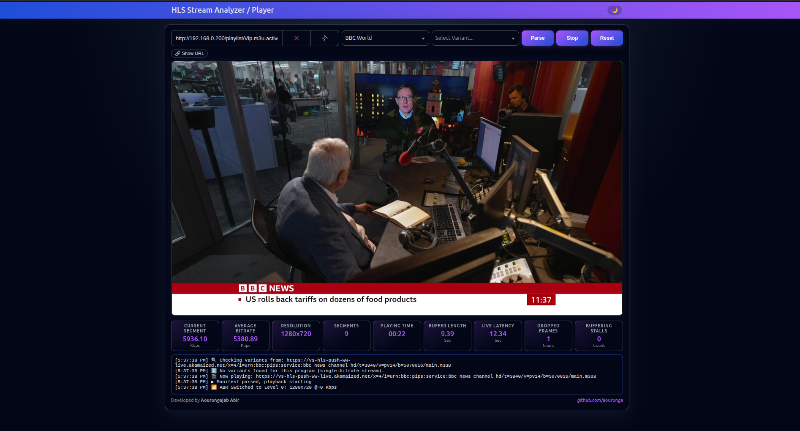
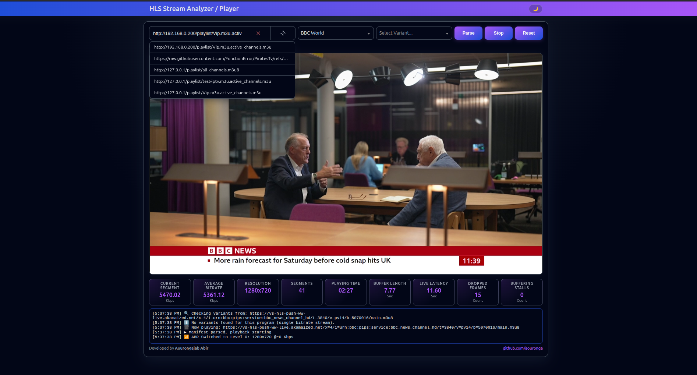
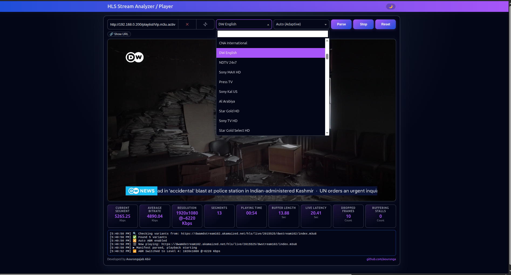
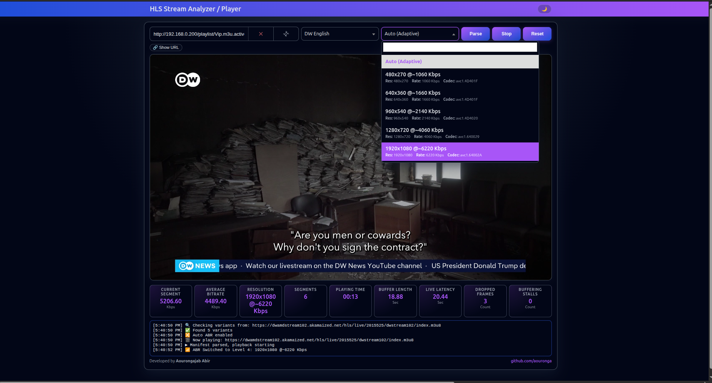

# 📺 HLS Multi-Program Bitrate Monitor  
### **Live Demo:** https://hls.plaasvision.com/

A modern, compact, and PWA-enabled web application to analyze, monitor, and test HLS streams — with full multi-program & multi-variant support.

## 🚀 Overview
The **HLS Multi-Program Bitrate Monitor** is a powerful browser-based HLS analysis tool built for IPTV engineers, broadcasters, OTT testers, developers, and streaming researchers.

It supports:
- ✔ Master playlists
- ✔ Single-bitrate `.m3u8`
- ✔ Multi-channel `.m3u` lists
- ✔ Direct HLS/TS streams

## ✨ Features
### 🔍 Smart Playlist Detection
- Detects master, single, multi-program, and direct streams
- Auto-extracts Programs & Variants

### 🎥 Real-Time Analysis
- Accurate segment bitrate (HEAD Content-Length method)
- Average bitrate
- Resolution switching
- Segment count
- ABR logs

### 📊 QoE Metrics
- Stall count
- Dropped frames
- Live latency
- Buffer size
- Playback duration

### 🎨 UI / UX
- Compact layout
- Select2 for Programs & Variants
- URL history system
- Theme switcher (Dark / Light)
- Mobile-first (no scrolling)

### 📱 PWA Ready
- Installable on Android, iOS, Windows, Mac, Linux
- Offline support
- Includes icons + manifest.json + service worker

## 🖼️ Screenshots






## 📂 Project Structure
```
/
│── index.html
│── style.css
│── script.js
│── manifest.json
│── service-worker.js
│── icons/
│     ├── 192x192.png
│     └── 512x512.png
│── screenshots/
│     ├── Screenshot-1.png
│     ├── Screenshot-2.png
│     ├── Screenshot-3.png
│     └── Screenshot-4.png
└── README.md
```

## 🔧 Technologies
Vanilla JS • Hls.js • Select2 • CSS3 • LocalStorage • PWA APIs • NGINX

## 🛠️ Deployment
Place project in:
```
/var/www/html/hls-analyzer-player
```

### Recommended NGINX configuration:
```
server {
    server_name hls.plaasvision.com;

    root /var/www/html/hls-analyzer-player;
    index index.html;

    location / {
        try_files $uri $uri/ /index.html;
    }

    location /service-worker.js {
        add_header Cache-Control "no-cache";
    }

    location /manifest.json {
        add_header Cache-Control "no-cache";
    }
}
```

## 🧭 Roadmap
- Thumbnails
- Export logs
- WebRTC mode
- Multi-window analyzer
- API for remote monitoring

## 🤝 Contributing
Pull requests welcome!

## 🧑‍💻 Developer
**Aourongajab Abir**  
GitHub: https://github.com/aouronga